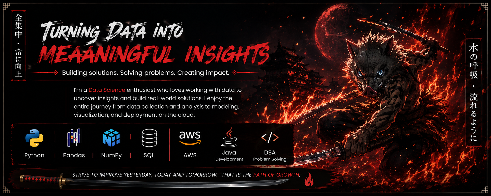

<!-- ========================================================= -->

<!--                     G0UTH9M PROFILE                       -->

<!-- ========================================================= -->

<p align="center">
  
</p>

<br>

<!-- ======================= INTRO =========================== -->

<h1 align="center">
  𝐇𝐢, 𝐈'𝐦 𝐆𝐨𝐮𝐭𝐡𝐚𝐦 👋
</h1>

<p align="center">
  <b>Data Science Enthusiast • Java Developer • DSA Problem Solver</b>
</p>

<p align="center">
  Turning data into meaningful insights, solving problems, and building real-world solutions.
</p>

<p align="center">
  <a href="https://github.com/G0uth9m">
    
  </a>
  <a href="https://www.linkedin.com/in/goutham-sridhar-8855b8334">
    
  </a>
</p>

---

<!-- ======================= ABOUT =========================== -->

## ⚔️ About Me

I'm a **Data Science enthusiast** interested in turning raw data into meaningful insights and practical solutions.

I enjoy exploring the complete journey of a project — from **data collection and cleaning to analysis, visualization, modeling, and deployment**.

Alongside Data Science, I'm building my skills in **Java development** and **Data Structures & Algorithms**, while continuously improving my problem-solving abilities.

```text
        DATA
          │
          ▼
     COLLECTION
          │
          ▼
       CLEANING
          │
          ▼
       ANALYSIS
          │
          ▼
    VISUALIZATION
          │
          ▼
      MODELING
          │
          ▼
     DEPLOYMENT
          │
          ▼
        IMPACT 🚀
```

### 🔥 What I'm Focused On

* 📊 Data Science & Data Analysis
* 🐍 Python development
* ☕ Java development
* 🧠 Data Structures & Algorithms
* 🗄️ SQL & databases
* ☁️ AWS & cloud technologies
* 🤖 Machine Learning fundamentals
* 🚀 Building practical projects
* 📚 Continuous learning

---

<!-- ======================= SKILLS ========================== -->

## 🛠️ Tech Stack

### 🐍 Programming

<p align="left">
  
</p>

`Python` `Java`

---

### 📊 Data Science & Analysis

<p align="left">
  
  
  
</p>

`Pandas` `NumPy` `Data Analysis` `Data Visualization`

---

### 🗄️ Database

<p align="left">
  
</p>

`SQL` `MySQL` `Data Querying`

---

### ☁️ Cloud & Development Tools

<p align="left">
  
</p>

`AWS` `Git` `GitHub` `VS Code`

---

### 🧠 Problem Solving

```text
Arrays
Strings
Linked Lists
Stacks & Queues
Sorting
Searching
Recursion
Algorithms
Object-Oriented Programming
```

---

<!-- ===================== WHAT I BUILD ====================== -->

## 🚀 What I Build

### 📊 Data Science Projects

I enjoy working with datasets to discover patterns, answer questions, and generate useful insights.

Typical workflow:

```text
Raw Data
   ↓
Data Cleaning
   ↓
Exploratory Data Analysis
   ↓
Visualization
   ↓
Insights
   ↓
Business / Real-World Decisions
```

---

### ☕ Java Projects

I'm building Java projects to strengthen:

* Core Java
* Object-Oriented Programming
* Collections
* Exception Handling
* Problem Solving
* Data Structures & Algorithms

---

### ☁️ Cloud Projects

I'm exploring AWS and cloud technologies to understand how applications and data workflows can be deployed and managed in real-world environments.

---

<!-- ======================= PROJECTS ======================== -->

## 📂 Projects

### 🍕 Pizza Sales Analysis

A data analysis project focused on understanding pizza sales and extracting useful insights from sales data.

**Focus Areas**

* Sales performance
* Revenue analysis
* Best-selling products
* Product comparison
* Customer purchasing patterns
* Data-driven recommendations

**Technologies**

`Python` `Pandas` `NumPy` `Data Analysis` `Visualization`

---

### 🛒 Walmart Sales Analysis

A retail data analysis project focused on exploring sales data and identifying meaningful business patterns.

**Focus Areas**

* Sales trends
* Product performance
* Revenue patterns
* Customer behavior
* Business insights

**Technologies**

`Python` `Pandas` `NumPy` `SQL` `Data Visualization`

---

### ☕ Java & DSA Practice

A collection of Java programs and problem-solving exercises focused on strengthening programming fundamentals and algorithmic thinking.

**Technologies**

`Java` `OOP` `DSA` `Algorithms`

---

> 🚧 More projects will be added as I continue building and learning.

---

<!-- ===================== LEARNING ========================== -->

## 📚 Currently Learning

<p align="center">

`Python` • `Pandas` • `NumPy` • `SQL` • `Java` • `DSA` • `AWS` • `Machine Learning`

</p>

### 🎯 Learning Path

```text
                 ┌──────────────────┐
                 │     Python       │
                 └────────┬─────────┘
                          ↓
                 ┌──────────────────┐
                 │  Data Analysis   │
                 └────────┬─────────┘
                          ↓
                 ┌──────────────────┐
                 │ Machine Learning │
                 └────────┬─────────┘
                          ↓
                 ┌──────────────────┐
                 │      AWS         │
                 └────────┬─────────┘
                          ↓
                 ┌──────────────────┐
                 │ Real-world Apps  │
                 └──────────────────┘
```

---

<!-- ===================== GITHUB STATS ===================== -->

## 📈 GitHub Statistics

<p align="center">

  

  

</p>
<!-- ================= CONTRIBUTION SNAKE =================== -->

## 🐍 Contribution Snake

<picture> <source media="(prefers-color-scheme: dark)" srcset="https://raw.githubusercontent.com/G0uth9m/G0uth9m/output/github-contribution-grid-snake-dark.svg" />

<source media="(prefers-color-scheme: light)" srcset="https://raw.githubusercontent.com/G0uth9m/G0uth9m/output/github-contribution-grid-snake.svg" />


</picture>


---

<!-- ======================= GOALS =========================== -->

## 🎯 Goals

* [ ] Build more real-world Data Science projects
* [ ] Strengthen Machine Learning fundamentals
* [ ] Improve Java development skills
* [ ] Master Data Structures & Algorithms
* [ ] Work with AWS and cloud technologies
* [ ] Build and deploy end-to-end projects
* [ ] Contribute to Open Source
* [ ] Solve more programming problems
* [ ] Keep learning and improving every day

---

<!-- ===================== PHILOSOPHY ======================== -->

## ⚔️ My Philosophy

<p align="center">

### **Learn → Build → Solve → Improve → Repeat**

</p>

<p align="center">
  <i>
    "Strive to improve yesterday, today and tomorrow."
  </i>
</p>

<p align="center">
  <b>Building solutions. Solving problems. Creating impact.</b>
</p>

---

<!-- ===================== CONNECT =========================== -->

## 🌐 Connect With Me

<p align="center">

<a href="https://github.com/G0uth9m">
  
</a>

<a href="https://www.linkedin.com/in/goutham-sridhar-8855b8334">
  
</a>

</p>

<p align="center">

<a href="https://github.com/G0uth9m">
  🔗 <b>GitHub Profile</b>
</a>

   |   

<a href="https://www.linkedin.com/in/goutham-sridhar-8855b8334">
  🔗 <b>LinkedIn Profile</b>
</a>

</p>

---

<!-- ======================= FOOTER ========================== -->

<p align="center">
  
</p>

<p align="center">
  <b>⚔️ Thanks for visiting my profile ⚔️</b>
</p>

<p align="center">
  ⭐ Explore my repositories and follow my journey ⭐
</p>
